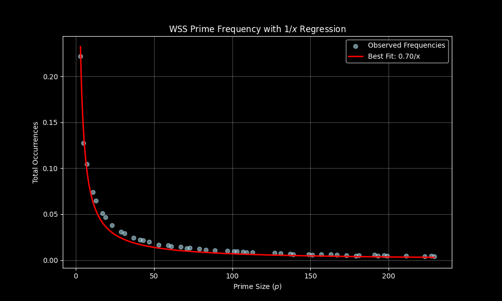

# Hi there 👋

I code to experiment and confirm ideas in my mathematical research. I deal primarily with number theory. I'm currently working on:

- Wall--Sun--Sun primes for an ISEF competition
- The rad function and the ABC conjecture
- The Erdos-Moser problem

My scripts are often generated with AI, but I know basic Python as well. My scripts are almost always computational or graphing. An example:

